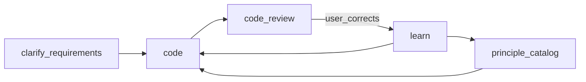

# AgentSkills

Repository of AI agent skills for structured discovery, alignment, and implementation.

## Install

**Cursor** (global): `~/.cursor/skills/`, `~/.agents/skills/` — Windows: `C:\Users\<user>\.cursor\skills` or `C:\Users\<user>\.agents\skills`

**GitHub Copilot** (global): `~/.copilot/skills/`

Copy or symlink skill folders into the appropriate directory.

## Workflow

**Feature**: `clarify-requirements` → `code` → `code-review` → done

**Correction**: fix → name principle → codebase sweep → `learn` proposal → `principle-catalog` update

**Ambitious**: `design-document-discovery` (if needed) → `gauntlet-loop` (builders + critics use `code-review`)

## Skills

| Skill | Role |
|---|---|
| `design-document-discovery` | Domain/system specs, vision-vs-code alignment |
| `clarify-requirements` | Feature plans (`/memories/session/plan.md`) with quality bar + reuse |
| `gauntlet-loop` | Builder + critic loops for ambitious artifacts |
| `code` | Authoring standards — discovery-first, correctness before perf |
| `code-review` | Mandatory self-review gate; `/code-review` for deep review |
| `frontend-design` | UI/UX |
| `learn` | Durable principles (generalized, user-approved) |
| `learn/references/principle-catalog.md` | Shared category prompts for learn + code-review |
