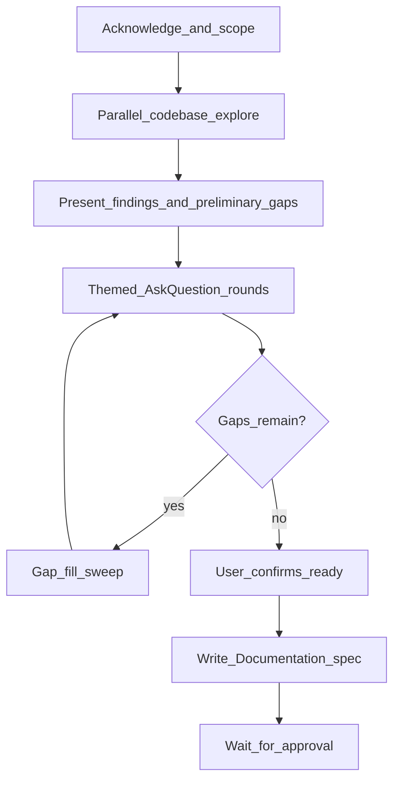

# design-document-discovery

Build authoritative domain specifications by aligning user vision with current implementation — no assumptions, no gaps. Output lives in `Documentation/` for long-term AI and team context.

## When to Use

- User invokes `/design-document-discovery` or asks for a design document, game spec, or domain spec
- Exhaustive alignment across an entire product area (game systems, API surface, app subsystem, workflow)
- Establishing durable context for future sessions
- Reconciling "how it works now" vs "how it should work"

## When NOT to Use

- **Single scoped feature** → use `clarify-requirements` instead (outputs `/memories/session/plan.md`)
- Simple rename, typo, or one-line fix → abbreviate or skip
- User explicitly wants to bypass alignment → acknowledge risks, proceed only if they confirm

## Relationship to clarify-requirements

| Skill | Scope | Output | When |
|---|---|---|---|
| `clarify-requirements` | Single feature / change | `/memories/session/plan.md` | Before implementing one task |
| `design-document-discovery` | Full domain / system | `Documentation/{Name}Specification.md` | Exhaustive vision-vs-code alignment |

**Order of use:** `design-document-discovery` establishes domain truth; `clarify-requirements` scopes individual features against it.

**Worked example:** BlindIt → `Documentation/GameSpecification.md`

---

## Strict Rules

- **Never** write implementation code during discovery
- **Never** make silent assumptions — state and confirm
- **Never** produce the final spec until the user confirms no remaining gaps
- **Never** skip gap-fill sweeps (probabilities, durations, edge cases, toast copy, refund rules)
- Run **every decision through the user** via `AskQuestion`
- Compare answers against **current code** and flag mismatches explicitly
- **Never** write to `/memories/session/plan.md` — that is `clarify-requirements`'s job

---

## Workflow



### Step 1 — Acknowledge and scope

In 2–4 sentences:

- What domain is being documented
- Intended output: `Documentation/{Domain}Specification.md` (user may override)
- What is clear, implied, or vague

### Step 2 — Parallel codebase exploration

When a codebase exists:

- Launch **2–3 `explore` subagents in parallel** on different angles (e.g. core loop, entities, visibility/permissions)
- Read existing docs: `Documentation/`, project skills, config files
- Deliverable: concise **"What I found"** — not a dump

Skip or minimise for greenfield domains with no code.

### Step 3 — Present findings + preliminary gaps

- Summarize current implementation
- List top **Code vs Vision** mismatches found in code
- Preview themed question rounds ahead

### Step 4 — Themed AskQuestion rounds

- **5–6 questions per round**, thematically grouped
- Use `AskQuestion` tool (not a 50-question wall of text)
- Every question needs an **"I'll explain in chat"** escape hatch
- Use `allow_multiple: true` for checklist-style questions
- If user skips a round, **re-offer with brief context** — do not silently drop topics
- When user says "more to discuss", offer a **checklist of remaining categories**

**Question categories** (skip N/A):

| Category | Examples |
|---|---|
| Core identity | Purpose, win conditions, core loop |
| Lifecycle | Phases, start/end, join/leave/kick/reconnect |
| Scoring/economy | Points, currency, debt, sources |
| Turns/timing | Actions per turn, timers, blocking rules |
| Visibility/permissions | Who sees what; server authority |
| Interactions | Movement, targeting, co-location rules |
| Entities | Items, nodes, roles, states |
| Wheels/randomness | Probabilities, mandatory vs optional, animation timing |
| UI/UX | Tab switching, confirmations, popups |
| Messaging | Toasts, activity log, chat, public vs private |
| Settings | Lobby/config defaults, toggles |
| Edge cases | Refunds, forfeits, stacking, revisits |
| Roadmap | Future types/features (document even if not v1) |
| Tooling | Debugger, admin, observability |

### Step 5 — Gap-fill sweeps (mandatory before spec)

After user says "almost done", **proactively hunt** underspecified areas:

- Probabilities and formulas (not just "who spins")
- Durations — define terms: turn vs round vs cycle
- Debt, negative values, floors, caps
- Message templates (public vs private variants)
- Config defaults and host overrides
- Interaction classification (mandatory vs optional vs no-wheel)

Present missed gaps as a new `AskQuestion` round. **Do not proceed with guesses.**

### Step 6 — Write specification

**Default path:** `Documentation/{Domain}Specification.md`

Structure:

```markdown
# {Domain} Specification

Authoritative reference for intended behavior. When code disagrees, this spec is the target.

## Table of Contents
[numbered sections]

## 1. Identity and Scope
## 2. Lifecycle / Phases
## 3. Core Rules
[domain-specific sections as needed]
## N. Architecture Overview (if codebase exists)
## N+1. Code vs Vision Gaps

| # | Area | Current code | Spec target |
```

Include mermaid diagrams where flows are complex. Link related project skills if they exist.

### Step 7 — Approval gate

- Present spec summary to user
- **Wait for explicit approval** before implementation planning or code changes
- Optionally add cross-reference from project architecture skill to the new spec file

---

## AskQuestion Round Discipline

**Good round (combat system):**
- Who picks wager type?
- Score weight formula?
- Winner/loser consequences?
- Coin wager limits with debt?
- Public vs private toasts?
- Mandatory vs optional for attacker?

**Bad round:**
- 30 unrelated questions in one numbered list
- Asking what code already answers (check codebase first)
- Single yes/no for an entire subsystem

---

## Gap-Fill Checklist

Before writing the spec, confirm these are resolved or explicitly N/A:

- [ ] Win/end conditions and tiebreakers
- [ ] Probability formulas (not just "wheel decides")
- [ ] Duration units defined (turn / round / cycle)
- [ ] Negative values, floors, caps (score, currency)
- [ ] Public vs private message templates
- [ ] Refund vs forfeit vs consume rules
- [ ] Mandatory vs optional interactions
- [ ] Server authority (what clients must never receive)
- [ ] Config defaults and lobby overrides
- [ ] Reconnect / kick / disconnect behavior
- [ ] Roadmap items documented separately from v1

---

## Anti-Patterns

| Anti-pattern | Why it fails |
|---|---|
| One giant question dump | User fatigue; missed nuance |
| Documenting current code as spec | Perpetuates bugs and ambiguity |
| Skipping probability/duration/message gaps | Implementation surprises later |
| Producing spec while user has open topics | Misalignment and rework |
| Writing to `/memories/session/plan.md` | Wrong skill; wrong artifact |
| Silent assumptions | "I fixed one thing, found five more" |

---

## Abbreviated Mode

For smaller domains (one subsystem, ~5 rules):

1. Brief codebase read (no parallel agents)
2. One or two AskQuestion rounds
3. Shorter spec (still includes Code vs Vision if code exists)
4. Still require user approval before implementation

Never abbreviate gap-fill for probability, duration, or messaging if those exist in the domain.

---

## After Approval

The spec is the **target**. Implementation work should:

1. Pick items from the Code vs Vision gap table
2. Use `clarify-requirements` for individual feature implementation plans
3. Update the gap table as items are fixed
