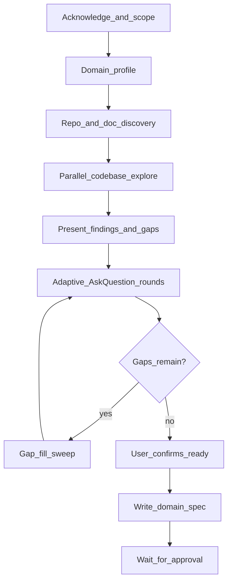

# design-document-discovery

Build authoritative domain specifications by aligning user vision with current implementation — no assumptions, no gaps. Output goes into the project's **existing documentation** (discovered during repo scan) for long-term AI and team context.

## When to Use

- User invokes `/design-document-discovery` or asks for a design document, domain spec, system spec, or architecture spec
- Exhaustive alignment across an entire product area (API surface, app subsystem, workflow, library module, data pipeline)
- Establishing durable context for future sessions
- Reconciling "how it works now" vs "how it should work"

## When NOT to Use

- **Single scoped feature** → use `clarify-requirements` instead (outputs `/memories/session/plan.md`)
- Simple rename, typo, or one-line fix → abbreviate or skip
- User explicitly wants to bypass alignment → acknowledge risks, proceed only if they confirm

## Relationship to clarify-requirements

| Skill | Scope | Output | When |
|---|---|---|---|
| `clarify-requirements` | Single feature / change | `/memories/session/plan.md` | Before implementing one task |
| `design-document-discovery` | Full domain / system | Domain spec in discovered docs path | Exhaustive vision-vs-code alignment |

**Order of use:** `design-document-discovery` establishes domain truth; `clarify-requirements` scopes individual features against it.

Each feature plan produced by `clarify-requirements` should include a **Domain Spec Reference** linking to the relevant sections of the domain spec. As features ship, update the domain spec's Code vs Vision gap table.

---

## Strict Rules

- **Never** write implementation code during discovery
- **Never** make silent assumptions — state and confirm
- **Never** produce the final spec until the user confirms no remaining gaps
- **Never** skip gap-fill sweeps for underspecified terminology, boundaries, errors, or domain-specific edge cases
- **Never** silently overwrite existing documentation — confirm append vs create vs overwrite via `AskQuestion`
- Run **every decision through the user** via `AskQuestion`
- Compare answers against **current code** and flag mismatches explicitly
- **Never** write to `/memories/session/plan.md` — that is `clarify-requirements`'s job

---

## Workflow



### Step 1 — Acknowledge and scope

In 2–4 sentences:

- What domain or subsystem is being documented
- What is clear, implied, or vague
- Whether a codebase exists or this is greenfield

### Step 2 — Domain profile

Classify the domain from the user's description **and** early codebase signals. Present a short **Domain profile**:

- **Type** — e.g. REST API, CLI tool, mobile app, web SPA, library, data pipeline, desktop app, embedded system
- **Primary actors** — users, services, admins, external systems
- **Key subsystems** — modules, services, or layers this spec will cover
- **Applicable extensions** — which domain-specific question themes apply (see Domain extensions below)

The profile drives which AskQuestion themes and gap-fill items are in scope. A calculator app and a multiplayer service should receive different question rounds — both should be thorough for their domain.

### Step 3 — Repo and documentation discovery

Before themed questions, scan the **whole repo** for existing documentation:

- Common folders: `docs/`, `Documentation/`, `doc/`, `wiki/`, `specs/`, `.github/`
- Root and nested: `README*`, `ARCHITECTURE*`, `CONTRIBUTING*`, `ADR*`, `DESIGN*`
- Paths referenced in README or project skills: `.cursor/skills/`, `.agents/skills/`, `.github/skills/`

Deliverable:

- List of existing docs relevant to this domain
- Suggested **target path** (prefer extending an existing doc in the same folder/convention when one matches the domain; else `{discoveredRoot}/specs/{domain-slug}.md`)
- Recommended mode: **append/extend** existing vs **create new**

Use `AskQuestion` to confirm:

- **Target path**
- **Mode**: append/extend existing | create new | overwrite (overwrite only on explicit confirmation)

Never silently overwrite existing documentation.

### Step 4 — Parallel codebase exploration

When a codebase exists:

- Launch **2–3 `explore` subagents in parallel** on angles derived from the domain profile (e.g. entry points, data models, auth layer, public API surface)
- Read project skills, config files, and docs found in Step 3
- Deliverable: concise **"What I found"** — not a dump

Skip or minimise for greenfield domains with no code.

### Step 5 — Present findings + preliminary gaps

- Summarize current implementation
- List top **Code vs Vision** mismatches found in code
- Preview upcoming AskQuestion themes (core + selected extensions)

### Step 6 — Adaptive AskQuestion rounds

- **5–6 questions per round**, thematically grouped
- Use `AskQuestion` tool (not a 50-question wall of text)
- Every question needs an **"I'll explain in chat"** escape hatch
- Use `allow_multiple: true` for checklist-style questions
- If user skips a round, **re-offer with brief context** — do not silently drop topics
- When user says "more to discuss", offer a **checklist of remaining themes**

Build rounds from **core themes + domain extensions** identified in the domain profile — not a fixed category list.

#### Core themes (always consider; skip N/A)

| Theme | Covers |
|---|---|
| Identity and scope | Purpose, boundaries, success criteria |
| Lifecycle and states | Start/end, phases, transitions |
| Data and entities | Models, relationships, persistence |
| Operations and workflows | User/system actions, pipelines |
| Rules and invariants | Business logic, validation, constraints |
| Permissions and visibility | AuthN/Z, roles, data exposure |
| Integration and I/O | APIs, events, external dependencies |
| UX and feedback | UI states, notifications, errors *(if applicable)* |
| Configuration | Defaults, environment, feature flags |
| Reliability | Failures, retries, idempotency, concurrency |
| Observability | Logging, metrics, debugging *(if applicable)* |
| Roadmap | Future scope documented separately from v1 |

#### Domain extensions (select after domain profile)

Add themes only when the domain warrants them:

| Extension | When to include | Example topics |
|---|---|---|
| Interactive / real-time | Live sessions, multiplayer, streaming | Timing, reconnect, sync, presence |
| Financial / commerce | Payments, billing, ledgers | Refunds, rounding, currency, idempotency |
| Stochastic | Randomness affects outcomes | Probabilities, seeds, fairness, auditability |
| Content / creative | Assets, publishing, versioning | Draft states, approval flows, media handling |
| Compliance | Regulated data or audit requirements | Retention, PII, audit trails, consent |

The agent may identify additional extension themes not listed here — document them in the domain profile before asking.

### Step 7 — Gap-fill sweeps (mandatory before spec)

After user says "almost done", **proactively hunt** underspecified areas:

- **Terminology** — define ambiguous words (e.g. "session", "batch", "request", "account")
- **Boundary values** — limits, caps, empty/null handling, overflow
- **Error paths** — failure modes and user-visible messages
- **Idempotency** — duplicate requests, retries, partial failure
- **Authz edge cases** — escalation, stale permissions, revoked access
- **Rollback / compensation** — undo, refund, vs hard failure
- **Offline / degraded mode** *(if applicable)*
- **Migration / backward compatibility** *(if existing users or data)*

Add domain-specific gap items from selected extensions (e.g. probability formulas for stochastic domains, rounding rules for financial domains).

Present missed gaps as a new `AskQuestion` round. **Do not proceed with guesses.**

### Step 8 — Write specification

Write to the **confirmed target path** from Step 3.

Structure:

```markdown
# {Domain} Specification

Authoritative reference for intended behavior. When code disagrees, this spec is the target.

## Table of Contents
[numbered sections]

## 1. Identity and Scope
## 2. Lifecycle and States
## 3. Core Rules
[domain-specific sections as needed]
## N. Architecture Overview (if codebase exists)
## N+1. Code vs Vision Gaps

| # | Area | Current code | Spec target |

## Related Feature Plans (optional)
| Feature | Plan path | Spec sections |
```

Include mermaid diagrams where flows are complex. Link related project skills if they exist.

When **appending** to an existing doc, add clearly delimited sections and update the table of contents — do not destroy unrelated content.

### Step 9 — Approval gate

- Present spec summary to user
- **Wait for explicit approval** before implementation planning or code changes
- Optionally add cross-reference from project architecture skill or README to the new/updated spec file

---

## AskQuestion Round Discipline

**Good round (API billing endpoint):**

- Which HTTP methods and idempotency keys?
- Rounding rules for fractional cents?
- Refund vs credit — when each applies?
- Webhook retry and dead-letter behavior?
- What the caller sees on timeout vs hard failure?
- Audit log fields required for compliance?

**Good round (calculator expression parser):**

- Operator precedence and associativity?
- Behavior for divide-by-zero and overflow?
- Supported number types (int, float, arbitrary precision)?
- Error message for invalid syntax vs unsupported function?
- Whitespace and locale handling?
- Should history undo/redo be in scope?

**Bad round:**

- 30 unrelated questions in one numbered list
- Asking what code already answers (check codebase first)
- Single yes/no for an entire subsystem
- Using a fixed game-specific checklist for a non-game domain

---

## Gap-Fill Checklist

Before writing the spec, confirm these are resolved or explicitly N/A:

- [ ] Success/end conditions and tiebreakers (or equivalent for the domain)
- [ ] Terminology defined — no ambiguous lifecycle words
- [ ] Boundary values, limits, caps, empty/null handling
- [ ] Error paths and user-visible messages
- [ ] Idempotency and duplicate handling
- [ ] Authz edge cases (escalation, stale permissions)
- [ ] Rollback/compensation vs hard failure
- [ ] Config defaults and environment overrides
- [ ] Offline/degraded mode *(if applicable)*
- [ ] Migration/backward compatibility *(if existing users or data)*
- [ ] Domain-extension items from profile *(e.g. probabilities, rounding, reconnect)*
- [ ] Roadmap items documented separately from v1

---

## Anti-Patterns

| Anti-pattern | Why it fails |
|---|---|
| One giant question dump | User fatigue; missed nuance |
| Documenting current code as spec | Perpetuates bugs and ambiguity |
| Fixed question list regardless of domain | Misses what matters; asks irrelevant questions |
| Skipping terminology/boundary/error gaps | Implementation surprises later |
| Silently overwriting existing docs | Destroys team context |
| Producing spec while user has open topics | Misalignment and rework |
| Writing to `/memories/session/plan.md` | Wrong skill; wrong artifact |
| Silent assumptions | "I fixed one thing, found five more" |

---

## Abbreviated Mode

For smaller domains (one subsystem, ~5 rules):

1. Brief codebase and doc read (no parallel agents)
2. One or two AskQuestion rounds using core themes only
3. Shorter spec (still includes Code vs Vision if code exists)
4. Still require user approval before implementation
5. Still confirm doc target path and append vs create

Never abbreviate gap-fill for terminology, boundaries, or errors if those exist in the domain.

---

## After Approval

The spec is the **target**. Implementation work should:

1. Pick items from the Code vs Vision gap table
2. Use `clarify-requirements` for individual feature implementation plans — each plan must reference relevant domain spec sections
3. Update the gap table and Related Feature Plans as items are fixed
