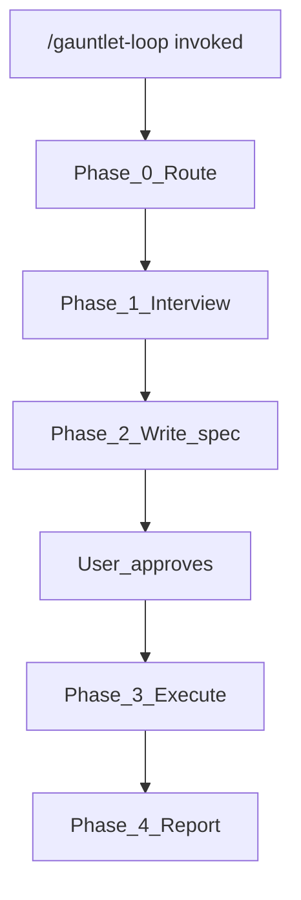

# gauntlet-loop

Orchestrate the **Gauntlet Loop** pattern: interview for objective, metric, and boundary; write a session spec; generate a short orchestration prompt; then run builder + critic loops until the quality bar wins or boundaries fire.

Popularized by Matt Shumer's [Claude of Duty](https://github.com/mshumer/Claude-of-Duty) experiment — one short prompt, many hours of autonomous build–criticize–improve cycles producing a playable browser FPS.

## When to Use

- User invokes `/gauntlet-loop`
- User asks to run a gauntlet loop on an ambitious, inspectable artifact
- Goal has a **concrete quality bar** (reference product, benchmark, rubric, test suite)
- Work benefits from decomposition, independent critics, and sustained iteration

## When NOT to Use

- Simple scoped task (rename, typo, single bug) → implement directly or use `clarify-requirements`
- No inspectable quality bar and none can be defined
- User wants a one-shot answer with no iteration

## Relationship to Other Skills

| Skill | Role in Gauntlet Loop |
|---|---|
| `design-document-discovery` | **Pre-flight** when domain/system truth is missing — run before interview or reference its spec |
| `clarify-requirements` | **Per-piece scoping** when a decomposed chunk is a discrete feature with acceptance criteria |
| `frontend-design` | **Visual/UI pieces** — design system, aesthetic bar, reference interpretation for critics |
| `code` | **All builder implementation** — builders must follow `code` skill rules |
| `loop` | **Per-piece iteration** — `/loop` on each independently judgeable unit |
| `canvas` | **Visual A/B comparison** when critics need side-by-side artifact review |
| `review-security` / `review-bugbot` | **Optional critics** for security or correctness gates on software pieces |
| `learn` | **Post-run** — capture durable patterns only with user approval |

**Order for greenfield ambitious work:** `design-document-discovery` (if needed) → `gauntlet-loop` → routed skills during execution.

**Artifact paths (do not conflict with other skills):**

| Skill | Path |
|---|---|
| `clarify-requirements` | `/memories/session/plan.md` |
| `design-document-discovery` | Project docs path (discovered) |
| `gauntlet-loop` | `/memories/session/gauntlet-loop.md` + `/memories/session/gauntlet-progress.md` |

---

## Workflow Overview

---

## Phase 0 — Acknowledge and Route

On invoke, acknowledge the request in 2–4 sentences, then route **before** the interview:

1. **Domain spec needed?** If unfamiliar/large codebase with no spec → recommend `design-document-discovery` first (or read `docs/specs/`, `ARCHITECTURE*`). If user proceeds anyway, note gaps in the gauntlet spec.
2. **Visual/UI involved?** Flag `frontend-design` for UI builders; critics must inspect pixels/screenshots, not summaries.
3. **Codebase check (proportional):** Same rule as `clarify-requirements` Step 2 — skim only what affects questions and constraints.

---

## Phase 1 — Structured Interview

Use `AskQuestion` — **~5 questions per round**, grouped by theme. Every question includes **"Other / I'll explain in chat"**. Use `allow_multiple: true` for checklist-style scope questions.

Build rounds from this **agent-only coverage guide** (do not dump verbatim to user). Skip N/A themes.

### A. Objective (destination, not route)

- What exact artifact must exist when done?
- Who is it for / what problem does it solve?
- What does "done" look like in one sentence?

### B. Quality bar (inspectable reference)

- What **concrete reference** will critics compare against?
- What evidence can critics inspect? (screenshots, tests, benchmarks, files)
- Is blind A/B comparison possible?

### C. Metric / verifier

- 3–5 pass/fail checks on **real output** (not builder summaries)
- Software: tests, lint, typecheck, security scan, interaction script
- Visual: viewport screenshots, animation, design token adherence

### D. Boundaries (mandatory)

"Until perfect" is motivating language, **not** a safe stop condition. Always capture:

- Time budget
- Cost/token ceiling (if relevant)
- Max rounds per piece before escalate
- Allowed vs forbidden without approval (deploy, spend, credentials, delete, external comms)
- Workspace scope (which dirs may change)

### E. Decomposition hints

Lead agent still chooses final decomposition. Ask for:

- Known independent subsystems
- Known **coupled** systems requiring sequential ownership
- Parallelism preference / max concurrent subagents

### F. Technology and constraints

- Stack / language / framework (or "agent chooses")
- Repo patterns to follow
- Out of scope for this run

### Iterate until resolved

After each round: synthesize decisions, gap-check, follow up only on unresolved items. Confirm readiness before Phase 2. Same discipline as `clarify-requirements` Step 4.

---

## Phase 2 — Write Gauntlet Spec

When interview is complete, write to **`/memories/session/gauntlet-loop.md`** using [templates/gauntlet-spec.md](templates/gauntlet-spec.md).

Required sections: Summary, Domain Spec Reference, Objective, Quality Bar, Metrics/Verifiers, Boundaries, Decomposition Plan, Piece Registry, Orchestration Prompt, Progress Log Path.

### Orchestration prompt rules

Embed a **2–4 paragraph** prompt in Matt Shumer style:

- Name deliverable and quality reference
- Permission to decompose and fan out builders where work is independent
- Separate harsh critic with fresh context per important piece
- `/loop` per piece until pass or boundary
- Critics inspect real output; blind A/B where possible; largest gap on fail
- Integration critic on complete artifact at end
- Boundaries and escalation for human judgment

**Do not** prescribe architecture, file layout, or fixed round counts.

**Present spec to user. Wait for explicit approval before Phase 3.**

For templates and critic/builder prompt skeletons, see [reference.md](reference.md).

---

## Phase 3 — Execute the Gauntlet

After approval, act as **orchestrator**.

### 3.1 Initialize progress log

Create `/memories/session/gauntlet-progress.md` from [templates/progress-log.md](templates/progress-log.md). Update after **every** round.

### 3.2 Decompose and register pieces

Refine decomposition; update Piece Registry in the spec.

- Pieces must be **independently judgeable**
- Coupled work → **one owner**, sequential rounds
- Each piece: builder scope, critic rubric, verifier commands

### 3.3 Per-piece loop

For each piece (parallel only when genuinely independent):

1. **Builder** — `Task` subagent (`generalPurpose`; `explore` for research). Follow `code` (+ `frontend-design` if UI). Produce observable artifact.
2. **Verify** — run real checks (tests, build, screenshot, browser snapshot via MCP if web UI).
3. **Critic** — separate `Task` subagent, **fresh context**. Prompt: objective snippet, bar, metrics, artifact paths, evidence only — **not** builder reasoning. Return: `PASS | FAIL | BLOCKED`, largest gap, fix target, evidence.
4. **FAIL** → feed gap to builder; increment rounds; check boundaries.
5. **PASS** → mark piece done; continue.

Use **`loop`** skill for timed re-entry when useful (e.g. `/loop 10m` re-run critic until pass or boundary).

Critic/builder prompt skeletons: [reference.md](reference.md).

### 3.4 Integration pass (mandatory)

When all pieces pass local critics, launch one **fresh integration critic** on the complete artifact:

- Consistency across pieces
- Seams and conflicts
- End-to-end objective
- No regressions

FAIL → assign fix pieces and loop again.

### 3.5 Stop conditions

Stop and report when:

- Success metrics pass (including integration critic)
- User stops the run
- Time/cost/round boundaries fire
- Same failure repeats without new strategy (spin detection)
- Blocker needs human judgment

---

## Phase 4 — Report and Optional Learn

Final report in chat:

- Built vs objective
- Piece registry final state
- Evidence summary (screenshots, test results, artifact paths)
- Honest assessment vs quality bar (report gaps honestly — the bar is a compass)
- Remaining work if stopped early

Offer `learn` only if user wants durable patterns captured.

---

## Strict Enforcement Rules

- **NEVER** start execution before spec approval
- **NEVER** let the builder act as its own critic
- **NEVER** accept critic verdicts based on summaries — require observable evidence
- **NEVER** loop without declared boundaries
- **NEVER** fan out parallel builders on tightly coupled pieces
- **NEVER** overwrite `clarify-requirements` or `design-document-discovery` artifacts
- **ALWAYS** maintain `gauntlet-progress.md` during long runs
- **ALWAYS** run integration critic before declaring victory

---

## Examples

### Example 1: Browser FPS (Claude of Duty style)

**User:** `/gauntlet-loop build a playable browser FPS like Call of Duty`

**Interview extracts:**

| Element | Value |
|---------|-------|
| Objective | Playable browser FPS: movement, shooting, enemies, HUD |
| Bar | Recent Call of Duty (screenshots/clips for blind comparison) |
| Metrics | Runs in browser; interaction tests; side-by-side on weapons, lighting, UI |
| Boundaries | Three.js; local only; no deploy; 8h cap; max 5 rounds/piece |

**Decomposition:** renderer/scene → player controller → weapons → enemy AI → HUD → audio → integration

**Flow:** Each piece: builder + visual critic + `/loop` → integration critic → honest report (may still lose blind A/B to real CoD).

### Example 2: Software feature in existing repo

**User:** `/gauntlet-loop implement the billing webhook handler to production quality`

**Interview extracts:**

| Element | Value |
|---------|-------|
| Objective | Webhook handler matching issue #142 acceptance criteria |
| Bar | Existing `payments/handler.ts` patterns + issue spec |
| Metrics | Unit tests, integration tests, lint, `review-security` pass |
| Boundaries | No prod deploy; no schema changes; 4h; max 3 rounds/piece |

**Decomposition:** handler impl → idempotency → error paths → tests → security review → integration

**Flow:** Builders follow `code`; critics run tests; optional `review-security` subagent; integration critic verifies E2E.

### Example 3: Marketing landing page

**User:** `/gauntlet-loop rebuild our pricing page to match Stripe's clarity`

**Interview extracts:**

| Element | Value |
|---------|-------|
| Objective | Responsive pricing page; visitor compares plans and completes checkout on mobile |
| Bar | stripe.com/pricing screenshots |
| Metrics | No a11y violations; no overflow at 360px; checkout E2E passes |
| Boundaries | Local only; preserve analytics; no deploy; 6h |

**Decomposition:** hierarchy → visual system → responsive → copy → a11y → performance → E2E checkout

**Flow:** UI builders use `frontend-design`; visual critics use screenshots + browser MCP; `canvas` for A/B if helpful.

---

## Additional Resources

- [reference.md](reference.md) — Claude of Duty annotation, copy-paste templates, failure modes, critic/builder skeletons, non-game examples
- [templates/gauntlet-spec.md](templates/gauntlet-spec.md) — session spec skeleton
- [templates/progress-log.md](templates/progress-log.md) — runtime progress tracker skeleton
